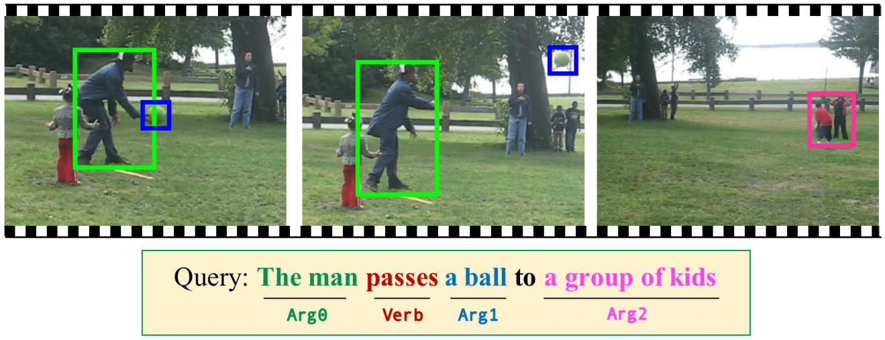

# vognet-pytorch
[**Video Object Grounding using Semantic Roles in Language Description**](https://arxiv.org/abs/2003.10606)<br>
[Arka Sadhu](https://theshadow29.github.io/), [Kan Chen](https://kanchen.info/) [Ram Nevatia](https://sites.usc.edu/iris-cvlab/professor-ram-nevatia/)<br>
[CVPR 2020](http://cvpr2020.thecvf.com/)

Video Object Grounding (VOG) is the task of localizing objects in a video referred in a query sentence description.
We elevate the role of object relations via a novel contrastive sampling method applied to a new dataset called ActivityNet-SRL (ASRL) based on existing caption and grounding datasets. 



This is the official repository for CVPR20 paper [Video Object Grounding using Semantic Roles in Language Description](https://arxiv.org/abs/2003.10606).

It includes:
1. code to create the ActivityNet-SRL dataset under `dcode/`
1. code to run all the experiments provided in the paper under `code/`

Code has been modularized from its initial implementation.
It should be easy to extend the code for other datasets by inheriting relevant modules. 

[EXPTS.md](./EXPTS.md) contains details on reproducing the results in the paper with pre-trained models and log files.

## Install

Requirements:
 - python>=3.6
  - pytorch==1.1

  To use the same environment you can use `conda` and the environment file `conda_env_vog.yml` file provided. Please refer to [Miniconda](https://docs.conda.io/en/latest/miniconda.html) for details on installing `conda`.

  ```
  MINICONDA_ROOT=[to your Miniconda/Anaconda root directory]
  conda env create -f conda_env_vog.yml --prefix $MINICONDA_ROOT/envs/vog_pyt
  conda activate vog_pyt
  ```

## Data Preparation

If you just want to use ASRL, you can refer to [DATA_README](./data/README.md)

If instead, you want to recreate ASRL from scratch, or perhaps want to extend to a newer dataset, refer to [DATA_PREP_README.md](./dcode/README.md)

## Training
Basic usage is `python code/main_dist.py "experiment_name" --arg1=val1 --arg2=val2` and the arg1, arg2 can be found in `configs/anet_srl_cfg.yml`.

The hierarchical structure of `yml` is also supported using `.`
For example, if you want to change the `mdl name` which looks like
```
mdl:
  name: xyz
```
you can pass `--mdl.name='abc'`

As an example, training `VOGNet` using `spat` strategy with `gt5` setting:

```
python code/main_dist.py "spat_vog_gt5" --ds.exp_setting='gt5' --mdl.name='vog' --mdl.obj_tx.use_rel=True --mdl.mul_tx.use_rel=True --train.prob_thresh=0.2 --train.bs=4 --train.epochs=10 --train.lr=1e-4
```

You can change default settings in `configs/anet_srl_cfg.yml` directly as well.

See [EXPTS.md](./EXPTS.md) for command-line instructions for all experiments.

## Logging

Logs are stored inside `tmp/` directory. When you run the code with $exp_name the following are stored:
- `txt_logs/$exp_name.txt`: the config used and the training, validation losses after ever epoch.
- `models/$exp_name.pth`: the model, optimizer, scheduler, accuracy, number of epochs and iterations completed are stored. Only the best model upto the current epoch is stored.
- `ext_logs/$exp_name.txt`: this uses the `logging` module of python to store the `logger.debug` outputs printed. Mainly used for debugging.
- `predictions`: the validation outputs of current best model.

## Evaluation
To evaluate a model, you need to first load it and then pass `--only_val=True`

As an example, to validate the `VOGNet` model trained in `spat` with `gt5` setting:
```
python code/main_dist.py "spat_vog_gt5_valid" --train.resume=True --train.resume_path='./tmp/models/spat_vog_gt5.pth' --mdl.name='vog' --mdl.obj_tx.use_rel=True --mdl.mul_tx.use_rel=True --only_val=True --train.prob_thresh=0.2
```

This will create `./tmp/predictions/spat_vog_gt5_valid/valid_0.pkl` and print out the metrics.

You can also evaluate this file using `code/eval_fn_corr.py`. This assumes `valid_0.pkl` file is already generated.

```
python code/eval_fn_corr.py --pred_file='./tmp/predictions/spat_vog_gt5_valid/valid_0.pkl' --split_type='valid' --train.prob_thresh=0.2
```

For evaluating `test` simply use `--split_type='test'`

If you are using your own code, but just want to use evaluation, you must save your output in the following format:
```
[
  {
  'idx_sent': id of the input query
  'pred_boxes': # num_srls x num_vids x num_frames x 5d prop boxes
  'pred_scores': # num_srls x num_vids x num_frames (between 0-1)
  'pred_cmp': # num_srls x num_frames (only required for sep). Basically, which video to choose
  'cmp_msk': 1/0s if any videos were padded and hence not considered
  'targ_cmp': which is the target video. This is in prediction and not ground-truth since we shuffle the video list at runtime
  },
  ...
]
```

## Pre-Trained Models

Google Drive Link for all models: https://drive.google.com/open?id=1e3FiX4FTC8n6UrzY9fTYQzFNKWHihzoQ

Also, see individual models (with corresponding logs) at [EXPTS.md](./EXPTS.md)

## Acknowledgements:

We thank:
1. @LuoweiZhou: for his codebase on GVD (https://github.com/facebookresearch/grounded-video-description) along with the extracted features.
2. [allennlp](https://github.com/allenai/allennlp) for providing [demo](https://demo.allennlp.org/semantic-role-labeling) and pre-trained model for SRL.
3. [fairseq](https://github.com/pytorch/fairseq) for providing a neat implementation of LSTM.

## Citation
```
@InProceedings{Sadhu_2020_CVPR,
	author = {Sadhu, Arka and Chen, Kan and Nevatia, Ram},
	title = {Video Object Grounding using Semantic Roles in Language Description},
	booktitle = {The IEEE Conference on Computer Vision and Pattern Recognition (CVPR)},
	month = {June},
	year = {2020}
}
```
